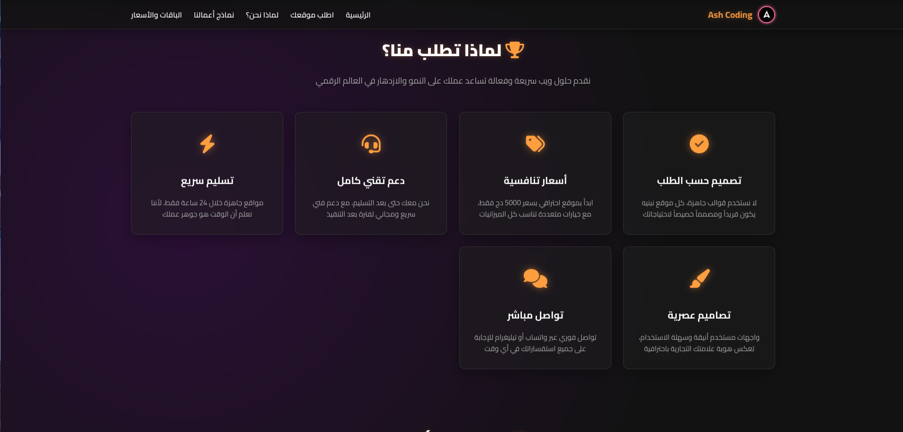
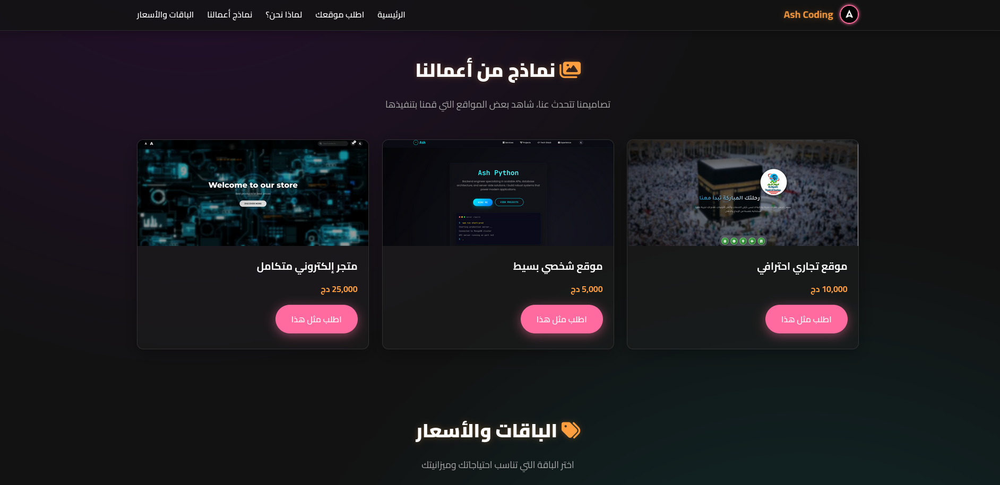
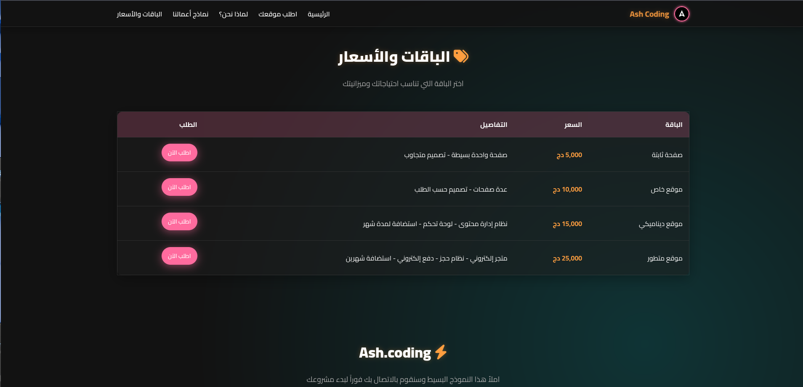
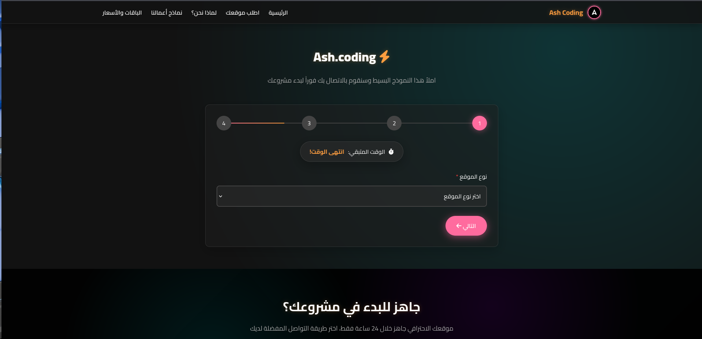
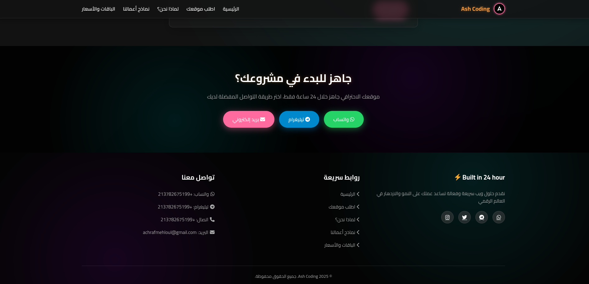

# 🚀 Ash Coding

**Ash Coding** is a clean, modern static landing page where clients can request custom website development. It offers a sleek UI to showcase services, pricing packages, and previous work — and allows clients to send order requests directly through **WhatsApp**, **Telegram**, or **Email**.

> "Fill out this simple form and we'll contact you immediately to start your project."

---

## 📸 Website Sections

- **Home Page**
- **Why Choose Us?**
- **Portfolio**
- **Pricing Plans**
- **Order Form**
- **Footer (Contact & Social Links)**

---

## 🌐 Live Preview

👉 [Visit the live site here](https://ash-coding.onrender.com)

---

## 🛠️ Technologies Used

- HTML5
- CSS3 (Glassmorphism, Neon Accents, Responsive Design)
- JavaScript (Form Validation, Step Navigation)

---

## 📁 Project Structure

```bash
.
├── index.html
└── static
    ├── css
    │   └── index.css
    ├── images
    │   ├── 1-1.png
    │   ├── 1.jpg
    │   ├── 1.png
    │   ├── 2.jpg
    │   ├── A.png
    │   ├── background.jpeg
    │   └── home.png
    ├── js
    │   └── index.js
    └── screen-shot
        ├── 1-11.png
        ├── 1-12.png
        ├── 1-13.png
        ├── 1-14.png
        ├── 1-15.png
        └── 1-16.png
```

---

## 🖼️ Screenshots

Here are some UI previews of the Ash Coding website:

### Home Page


### Why Choose Us



### Portfolio



### Pricing



### Order Form



### Footer & Contact



---

## ⚙️ How to Use

1. Clone or download this repository.
2. Open `index.html` in your browser.
3. Use **Live Server** for better development experience.

---

## 📬 Contact & Social

- 📸 Instagram: [@a._.coding](https://www.instagram.com/a._.coding/)
- 💬 Telegram: [+213782675199](https://t.me/+213782675199)
- 💬 WhatsApp: [+213782675199](https://wa.me/213782675199)

---

## 💡 License

This project is open for inspiration and personal use.

---

## ✨ Created by [Ash Coding](https://www.instagram.com/a._.coding/)
